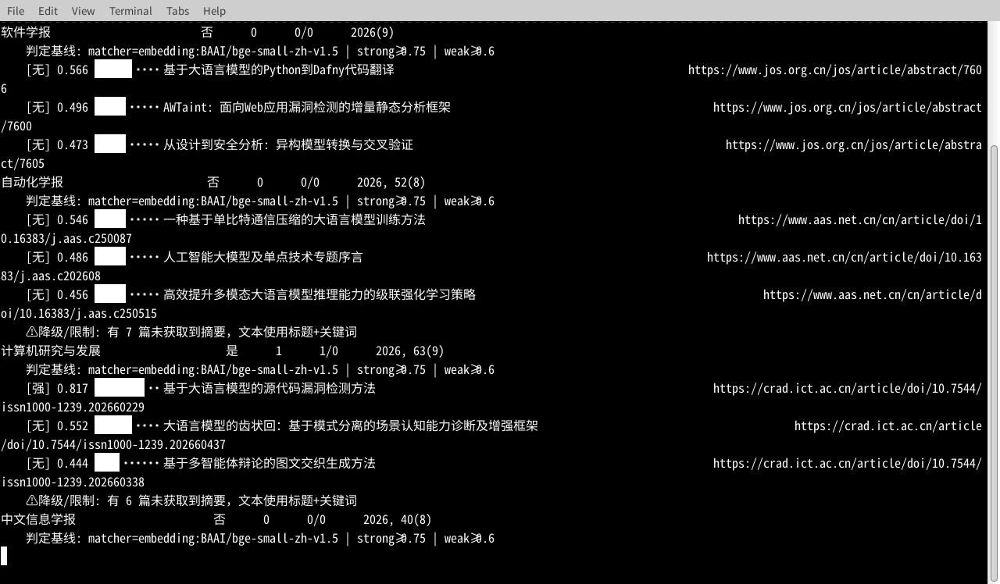
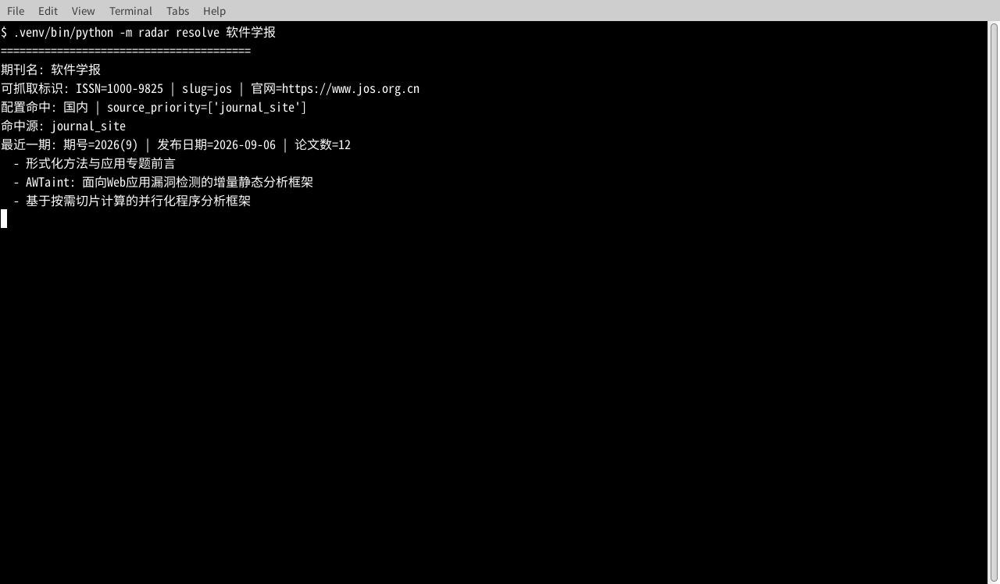
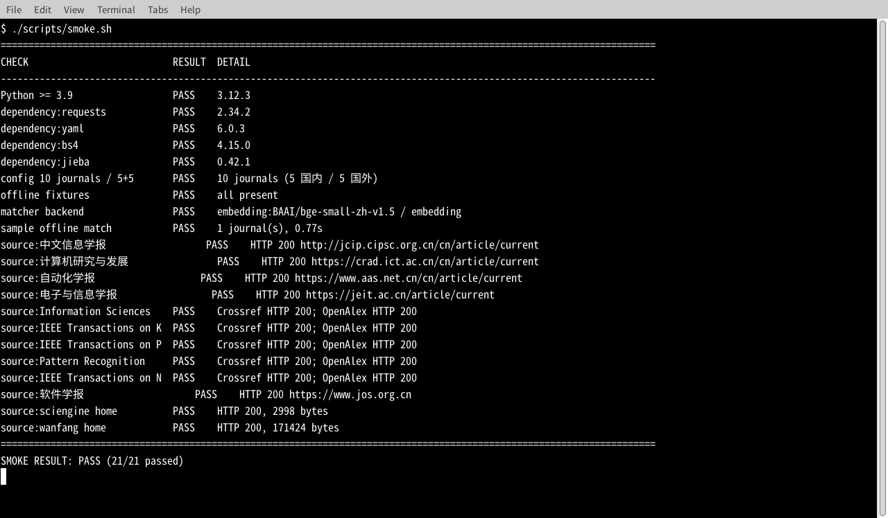
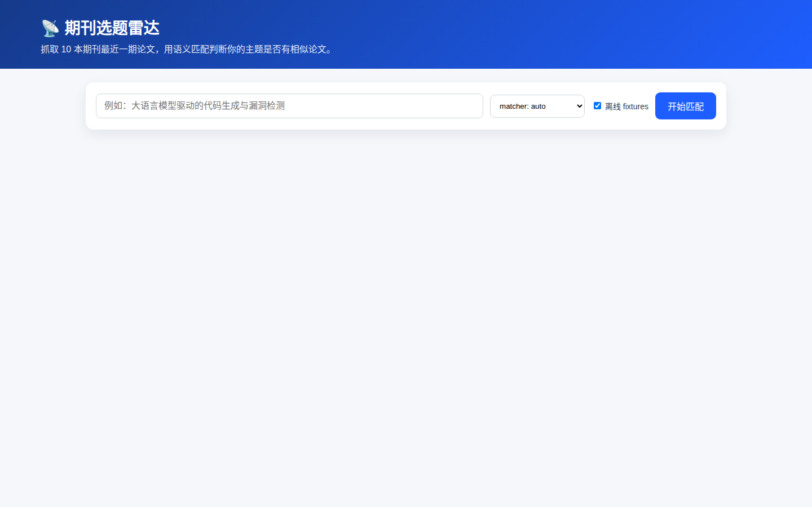
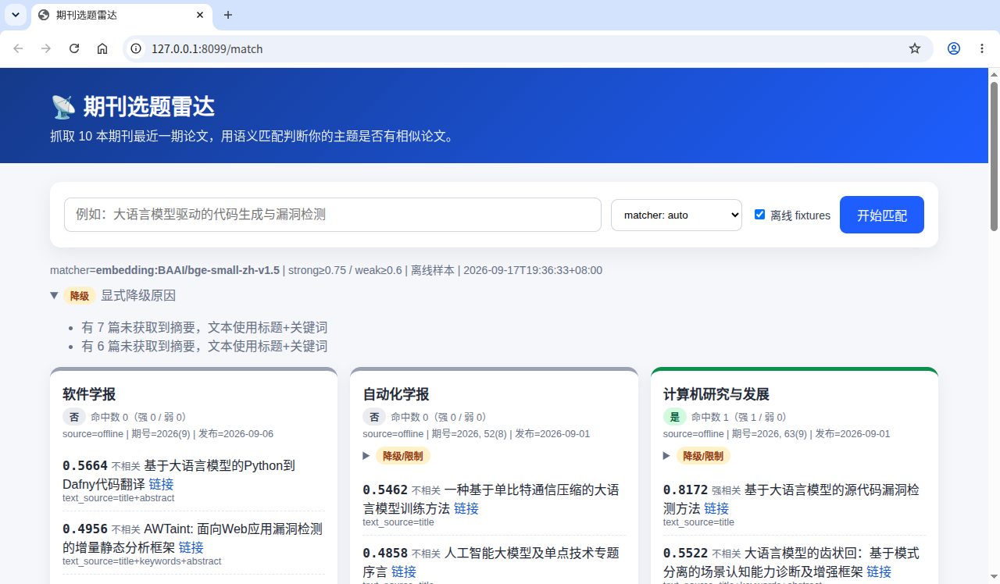

# journal-topic-radar 期刊选题雷达

抓取 10 本运行时期刊（国内 5 + 国外 5）的最近一期论文，对用户输入主题做语义匹配，
输出每刊是否命中、命中数和 Top-3 相似论文；支持终端表格、JSON、Markdown 与零额外依赖 Web UI。

## 1. 5 分钟跑起来（第一条就是三条命令）

```bash
python3 -m venv .venv
.venv/bin/pip install -i https://pypi.tuna.tsinghua.edu.cn/simple -r requirements.txt
./scripts/demo.sh "大语言模型驱动的代码生成与漏洞检测"
```

第三条 `scripts/demo.sh` 默认走 `--offline`，用 `fixtures/` 里的真实抓取样本跑完整链路，
不联网也能演示；它会打印终端表格，并写出 `docs/demo-output/latest.json` 与 `latest.md`。

> 说明：仓库根目录有 `radar -> src/radar` 软链接，所以在仓库根目录可直接 `python -m radar ...`。
> 如果部署环境不支持软链接，请执行 `.venv/bin/pip install -i ... -e .`，效果相同。

### 开启真正 embedding 后端（可选，体积大，可后台安装）

```bash
# CPU torch / sentence-transformers 体积较大；镜像走清华，模型走 HF 镜像
HF_ENDPOINT=https://hf-mirror.com \
  .venv/bin/pip install -i https://pypi.tuna.tsinghua.edu.cn/simple -r requirements-embed.txt
HF_ENDPOINT=https://hf-mirror.com \
  .venv/bin/python -c "from sentence_transformers import SentenceTransformer as S; S('BAAI/bge-small-zh-v1.5', cache_folder='models')"
```

模型会缓存到项目内 `models/`。**本仓库不内置模型权重**（体积大、属可再生成的缓存），首次运行按上面的命令自动拉取即可；没有权重时 matcher 会显式降级为词法后端，并在报告头部标注 `matcher=lexical (degraded: 原因)`，不会伪装成语义匹配。
matcher 自动选择规则：能加载 BGE 就用 BGE，否则降级为 `jieba + 词/字 n-gram` 的 BM25 风格词法后端，
并在报告头部显式打印 `matcher=lexical (degraded: 原因)`，绝不伪装成语义匹配。

## 2. 常用 CLI

```bash
# 现场解析：打印可抓取标识 + 命中源 + 最近一期期号/发布日期
python -m radar resolve "软件学报"

# 在线匹配全部 10 本刊，终端表格
python -m radar match --topic "大语言模型驱动的代码生成与漏洞检测"

# 离线演示（fixtures 真实样本，不联网）
python -m radar match --topic "大语言模型驱动的代码生成与漏洞检测" --offline

# 三种输出：table / json / markdown / all；--output 前缀会同时写 .json 和 .md
python -m radar match --topic "知识图谱补全" --offline --format all \
  --output docs/demo-output/knowledge-graph

# 只匹配某几本刊
python -m radar match --topic "计算机视觉" --journal "自动化学报" --journal "IEEE TPAMI"
```

`--matcher` 可选 `auto|embedding|lexical`。`--offline` 时任何缺失样本都会在结果中标注失败，
不会静默返回空结论。

## 3. Web UI（stdlib，零额外依赖）

```bash
python -m radar.web --port 8099      # 默认端口就是 8099
# 浏览器打开 http://127.0.0.1:8099
```

页面输入主题，返回每刊结果卡片：是否命中、命中数、强/弱相关数、Top 论文标题/分数/链接；
默认勾选“离线 fixtures”，现场断网可直接演示。也提供 `GET /api/match?topic=...&offline=1` 返回 JSON。

## 4. 面试现场：拿到新期刊名后的三步操作

1. **先在线解析，优先零配置直接接进来**：

   ```bash
   python -m radar resolve "<期刊名>"
   ```

   `resolve` 会先在 `config/journals.yaml` 中查找；配置外期刊会继续在线解析：
   - Crossref 候选：`GET https://api.crossref.org/journals?query=<名>&rows=5`，打印名称 / ISSN / 出版方 / 命中源；
   - Crossref 无精确命中时，OpenAlex 兜底：`GET https://api.openalex.org/sources?search=<名>&per-page=5`；
   - 拿到候选 ISSN 后立刻尝试 `GET https://api.crossref.org/journals/<issn>/works?sort=published&order=desc&rows=15`，打印最近期号、发布日期和前 3 条标题；取不到就打印真实 HTTP 状态或异常原因，不会伪造。

   如果在线解析拿到 ISSN，希望把该刊落进运行时名单，可加：

   ```bash
   python -m radar resolve "<期刊名>" --append-config
   ```

   只会追加到 `config/journals.yaml`；country 按名称/出版方判断，`source_priority=[crossref, openalex]`，slug 规范化。若配置中已有同名/同别名或同 ISSN 项，会明确报错并返回非零，绝不覆盖已有项。若 ISSN 已拿到但 Crossref works 暂时没有记录，命令会先如实追加配置并打印 works 的真实失败原因，不会伪造最近一期。

2. **在线国际源解析不到时，再按手工三步添加 config**：编辑 `config/journals.yaml`，在 `journals:` 下追加一项，至少填写
   `name`、`aliases`、`country`、`issn`、`official_site`、`slug`、`source_priority`；
   国内刊建议再加 `site_url` / `current_url` / `parser: magtech|jos`。然后重新运行
   `python -m radar resolve "<期刊名>"`：
   - 成功：确认打印的 ISSN/slug/官网、命中源、期号与发布日期。
   - 失败：输出会列出 `source_priority` 中尝试过的候选源和真实失败原因；按提示调整 URL/parser，
     或按“抓不到就换一本可抓的”原则替换该刊并在 `docs/source-evidence.md` 记录原因。

   **中文刊现实边界**：中文刊普遍不被 Crossref/OpenAlex 收录，或 OpenAlex 只能返回模糊候选/无 ISSN 记录。此时 `resolve` 会如实提示
   “该刊未被国际源收录，请按 README 三步手工添加（提供官网 URL + parser）”，必须补官网 URL + parser 才能抓取，不能把模糊候选当作成功。

3. **跑匹配**：

   ```bash
   python -m radar match --topic "<面试主题>" --journal "<期刊名>" --format all
   ```

   现场断网时加 `--offline`；若该刊尚未加入 fixtures，需要通过在线抓取或补真实样本后再演示。

## 5. 配置与阈值

- `config/journals.yaml`：唯一期刊名单来源；禁止在代码中写死期刊名。
- `config/thresholds.yaml`：可调阈值。
  - embedding：`strong >= 0.75`，`weak >= 0.60`
  - lexical：`strong >= 0.30`，`weak >= 0.11`（由 `scripts/calibrate_lexical.py` 在真实 fixtures 上标定）
- 期刊级命中：命中数 = 相似度 ≥ weak 的论文数；`是否相似 = 命中数 ≥ 1`。
- 每条结论在 Markdown/JSON 中带 `matcher`、`thresholds`；终端表格每行下方打印判定基线。

## 6. 目录与关键文件

```text
config/journals.yaml          10 本运行时期刊
config/thresholds.yaml        阈值
fixtures/<slug>.json          真实在线抓取后标准化的离线样本
fixtures/raw/<slug>.txt       真实 HTTP 响应片段
models/bge-small-zh-v1.5      BGE 离线缓存软链
docs/source-evidence.md       每源真实 HTTP 证据
docs/run-online.md            在线 10 刊全流程真实输出
docs/run-online-resolve.md    配置外期刊在线解析真实输出
docs/test-summary.txt         pytest 汇总行
scripts/smoke.sh              一条命令自检（Python/依赖/配置/源连通性/matcher/样例）
scripts/demo.sh               离线演示
scripts/calibrate_lexical.py  词法阈值标定
```

## 7. 常见故障

| 现象 | 原因 | 处理 |
|---|---|---|
| 输出 `matcher=lexical (degraded: ...)` | sentence-transformers 或 BGE 模型不可用 | 这是显式降级；按第 1 节安装 embedding 依赖并把模型缓存到 `models/` |
| `resolve` 打印 404/超时 | 期刊官网改版或目标 URL 失效 | 查看失败候选与 URL；改 `current_url`/`site_url`，或换可抓刊物并更新证据文档 |
| 国内刊摘要缺失 | 官网列表页/详情页未公开摘要 | 字段为“有则”；记录 `text_source=title+keywords`，报告/日志显式标注，不伪造 |
| 国外刊近几年无记录 | 该刊 Crossref 覆盖差 | 换 OpenAlex 或换刊；`source_priority` 不要预设“一定可用” |
| 离线演示缺 fixtures | 未抓过该刊或文件不存在 | `python scripts/capture_evidence.py` 联网补齐；断网现场需提前准备 |
| 8099 端口被占用 | 已有进程 | `python -m radar.web --port 8098`，但要求端口 8099 时先结束旧进程 |
| 搜索结果全英文、跨语言分数低 | BGE 中文模型对中英混合文本的压缩 | 优先用 BGE；报告分数和 `text_source` 可解释，不要用词法分数冒充语义分数 |

## 8. 为什么现场可用

- `scripts/smoke.sh` 一条命令输出 PASS/FAIL 表：Python、依赖、10 刊配置、fixtures、
  matcher 后端、离线样例、每个默认源的实时连通性。
- `docs/source-evidence.md` 有每刊真实 HTTP 状态、期号、发布日期与前 3 条标题。
- `docs/run-online.md` 有在线 10 刊全流程真实输出和耗时。
- 所有失败/降级都会进入 JSON 的 `degradation_reasons`、Markdown 顶部警示和日志。

## 9. 跨平台注意（软链与路径）

本仓库根目录的 `radar -> src/radar` 软链是为了让 `python -m radar ...` 在仓库根目录直接可用
（`models/` 下的 BGE 缓存同样使用软链，这是 HuggingFace 缓存的标准布局）。

如果解压工具没有恢复软链（典型现象：`python -m radar resolve ...` 报
`No module named radar.__main__; 'radar' is a package and cannot be directly executed`），
有以下三条等价路径，任选一条即可，不需要改代码：

```bash
PYTHONPATH=src .venv/bin/python -m radar resolve "软件学报"   # ① 最省事
.venv/bin/pip install -i https://pypi.tuna.tsinghua.edu.cn/simple -e .   # ② 装成可执行包
ln -s src/radar radar                                          # ③ 手工补回软链（macOS/Linux）
```

`models/` 同理：若软链丢失导致 BGE 缓存不可用，可重建为真实文件（体积约 2 倍）
或用 `HF_ENDPOINT=https://hf-mirror.com` 重新下载模型；此时 matcher 会显式降级为
`lexical (degraded: ...)`，不会伪装成语义匹配。

## 10. 运行截图（真实运行截图，非示意图）

| 截图 | 说明 |
|---|---|
|  | `radar match --topic "..." --offline`：逐刊判定表 + Top 论文 + 判定基线（`matcher=embedding:BAAI/bge-small-zh-v1.5`） |
|  | `radar resolve "软件学报"`：ISSN / 官网 / 命中源 / 最近一期期号与发布日期 / 前 3 条标题 |
|  | `scripts/smoke.sh`：21 项检查全 PASS，含 10 本刊的实时连通性 |
|  | Web UI（stdlib，零额外依赖）：输入主题 + matcher 选择 + 离线样本开关 |
|  | Web UI 结果页：每刊是否命中、命中数（强/弱）、Top 论文分数与链接、降级提示 |

截图取自本机真实运行（离线 fixtures 模式，`matcher=embedding`），
用于说明"跑起来长什么样"；可复现命令见第 1、2 节。
